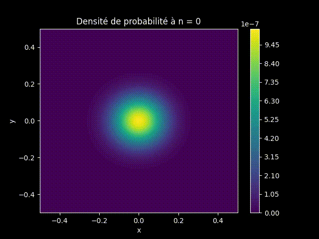
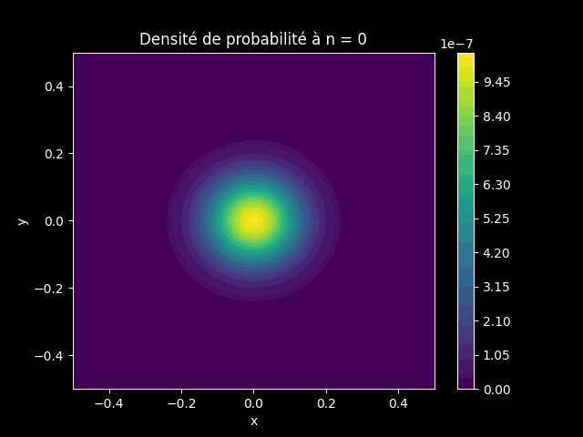

## Résolution numérique de l'équation de Schrödinger dépendante du temps 2D

Un programme codé en Python pour résoudre l'équation de Schrödinger dépendante du temps à deux dimensions.

### Aperçu

  
  

  
  
  

### Théorie

*En construction*
