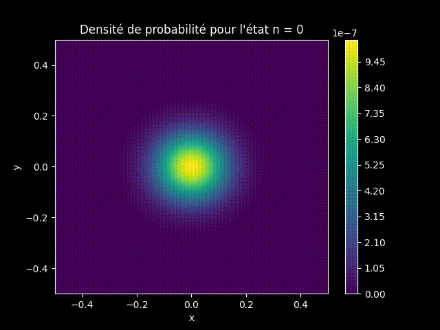

## Résolution numérique de l'équation de Schrödinger dépendante et indépendante du temps 2D

Deux programmes codés en Python pour résoudre l'équation de Schrödinger dépendante/indépendante du temps à deux dimensions.

### Aperçu
Équation de Schrödinger dépendante du temps (ici potentiel gaussien)

  
  

Équation de Schrödinger indépendante du temps (ici potentiel harmonique)

  
  

### Théorie

*En construction*
